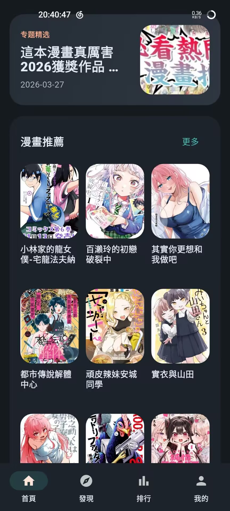
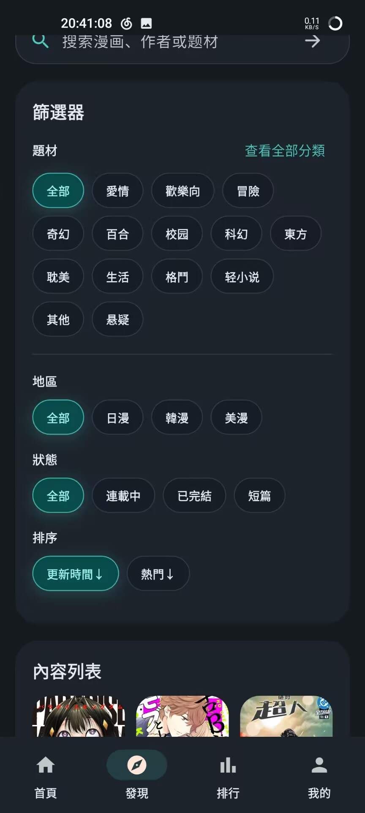
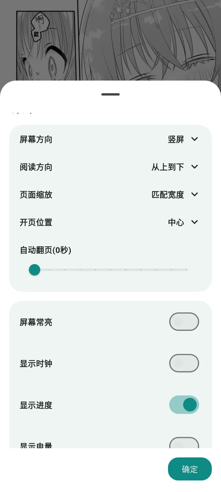

<div align="center">
  
  <h1>EasyCopy</h1>
  <p>用 Flutter 写的 Android 漫画阅读器</p>
</div>

---

## 这是什么

一个第三方漫画客户端。后台用 WebView 加载目标站点页面、提取数据，前端用 Flutter 原生组件渲染 UI。不是 WebView 套壳，也不是通用爬虫框架——只针对特定站点做了适配。

目前只做了 Android。

## 主要功能

- **原生页面**：首页、发现、排行、搜索、漫画详情、个人页
- **阅读器**：纵向滚动 / 左右翻页，支持适屏、全屏、常亮、音量键翻页、自动翻页、进度记忆
- **账号**：支持原生登录和网页登录兜底，登录状态全局同步
- **节点管理**：启动时自动探测可用节点，网络异常自动切换，也可以手动锁定
- **下载缓存**：下载队列持久化，支持暂停/继续/重试，支持缓存目录迁移，重启后恢复未完成任务
- **主题**：浅色 / 深色 / 跟随系统

## 截图

| 首页 | 发现筛选 |
| :---: | :---: |
|  |  |

| 阅读页 | 阅读设置 |
| :---: | :---: |
|  |  |

## 工作原理

1. 后台 WebView 用桌面 UA 加载站点页面
2. 注入 JS 脚本提取结构化数据
3. Flutter 侧把数据映射成页面模型
4. 原生组件根据模型渲染 UI

好处是能复用站点的内容和账号体系，同时拿到原生界面的控制权（主题、缓存、交互等）。坏处是站点改版就得跟着改解析脚本。

## 目录结构

```text
lib/
├── config/            # 全局配置
├── easy_copy_screen/  # 主界面逻辑
├── models/            # 数据模型
├── services/          # 业务服务（节点、下载、登录等）
├── theme/             # 主题
├── webview/           # 注入脚本
└── widgets/           # UI 组件

android/               # Android 工程
docs/                  # 文档和截图
test/                  # 测试
```

## 本地开发

需要：

- Flutter stable（CI 用的 3.41.4）
- Dart 3.9+
- Android SDK
- Java 17

```bash
flutter pub get
flutter run -d android
```

检查：

```bash
flutter analyze
flutter test
```

## 构建

```bash
flutter build apk --release --target-platform=android-arm,android-arm64,android-x64 --split-per-abi
```

产物在 `build/app/outputs/flutter-apk/`。

仓库有 GitHub Actions，推 `v*` tag 会自动构建发布。如果有 `.github/release-notes/v版本号.md` 文件会自动用作 Release Note。

---

<div align="center">
  <p>Built by Huangusaki</p>
</div>
